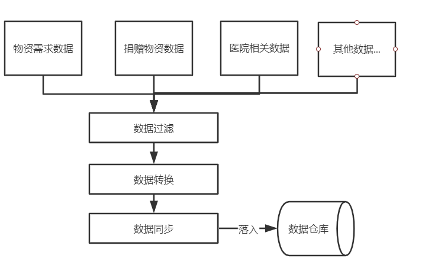

# data-sync

武汉新型冠状病毒防疫信息收集平台的数据同步服务，主要流程为从石墨文档采集各类数据，整合汇聚后同步到Github数据仓库中，供前端和数据分析组使用。

use typescript && egg

## QuickStart

### Development

```bash
$ npm i
$ npm run dev
$ open http://localhost:7001/
```

Don't tsc compile at development mode, if you had run `tsc` then you need to `npm run clean` before `npm run dev`.

### Deploy

```bash
$ npm run tsc
$ npm start
```

### Npm Scripts

- Use `npm run lint` to check code style
- Use `npm test` to run unit test
- se `npm run clean` to clean compiled js at development mode once

### Requirement

- Node.js 8.x
- Typescript 2.8+

## 功能架构图


## 数据处理流程图



利用各数据文件的schema信息从石墨文档中获取各类数据，并进行**数据过滤**，如剔除未审核的数据，过滤已接收物资的医院等；**数据转换**将数据转换为json、yaml、csv等格式；**数据同步**将数据同步到Github的数据仓库上。


## 贡献指南

请点击[这里](https://github.com/wuhan2020/wuhan2020/blob/master/CONTRIBUTING.md)
